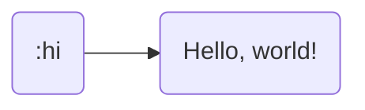
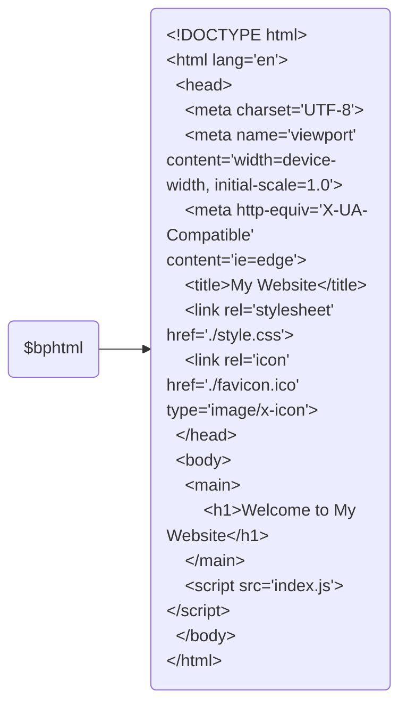

<h1 align="center">Hypoinput</h1>

<p align="center">
    
</p>

<p align="center">
    <a href="https://github.com/giosali/hypoinput/releases">
		
	</a>
    <a href="https://github.com/giosali/hypoinput/releases">
		
	</a>
    <a href="https://github.com/giosali/hypoinput/releases">
		
	</a>
    <a href="#">
        
    </a>
</p>

<p align="center">
    <a href="https://github.com/giosali/hypoinput/actions/workflows/build.yml">
        
    </a>
    <a href="https://github.com/giosali/hypoinput/actions/workflows/tests.yml">
        
    </a>
</p>

<p align="center">
    <b>Hypoinput</b> is a lightweight text expansion application for Windows
</p>

## Table of Contents

- [❓ What Are Text Expansions?](#-what-are-text-expansions)
- [🎛️ Features](#-features)
  * [UTF-8](#utf-8)
  * [Unique Triggers](#unique-triggers)
  * [Cursor Position](#cursor-position)
- [🎁 Installation](#-installation)
- [🔧 Usage](#-usage)
  * [GUI Editor](#gui-editor)
    + [Adding a Text Expansion](#adding-a-text-expansion)
    + [Editing or Deleting a Text Expansion](#editing-or-deleting-a-text-expansion)
  * [Manually Creating, Editing, or Deleting a Text Expansion](#manually-creating-editing-or-deleting-a-text-expansion)
  * [Disabling Hypoinput](#disabling-hypoinput)

## ❓ What Are Text Expansions?

A text expansion is text that is automatically printed after typing some other specific text. The text that is automatically printed is known as the `replacement` while the specific text is known as the `trigger`. These two texts are what form a text expansion.

Text expansions can be fairly simple:



In this example, when you type `:hi`, that text you typed will be erased and replaced by `Hello, world!`. It's simple, but these quick and short text expansions can save you *a lot* of time.

On the other hand, text expansions can also be complex:



As you can see, typing `$bphtml` produces some typical boilerplate HTML. Instead of memorizing a long piece of text or having to always look something up, you can simply keep it stored as a text expansion.

## 🎛️ Features

**Hypoinput** comes with many practical and handy features that you'd expect from a text expansion application.

### UTF-8

**Hypoinput** supports Unicode characters which means there's a wide range of characters that can be printed through text expansions, including but not limited to:

- Emojis (😀😊😉😍)
- Accented letters (à, è, ì, ò, ù, À, È, Ì, Ò, Ù)
- Chinese (漢字)

### Unique Triggers

Your input for getting a text expansion to trigger isn't limited to lowercase characters. With **Hypoinput**, your triggers can consist of both uppercase letters and special characters.

A couple valid triggers:

- `:_hello`
- `$GOODbye`
- `{bracket/trigger}`

If you can type it, you can use it!

### Cursor Position

If you've ever wished you could have a text expander application move or adjust the cursor position for you after triggering a text expansion, then this is the application for you.

**Hypoinput** has some keywords that you can use in your text replacements. A few of these keywords move the cursor position:

<div align="center">

|          Keyword         |                   Use                               |                         Example                       |
| :----------------------: | :-------------------------------------------------- | :---------------------------------------------------- |
|     {{\_\_CURSOR\_\_}}   | Moves cursor position to this location              | "Hello {{\_\_CURSOR\_\_}}, how are you?"              |
| {{\_\_CURSOR_PASTE\_\_}} | Moves cursor position and pastes clipboard contents | "python_program {{\_\_CURSOR_PASTE\_\_}} --foo --bar" |

</div>

**Hypoinput** can only process one of these in each text replacement. In other words, if you have multiple `{{__CURSOR__}}`'s or multiple `{{__CURSOR_PASTE__}}`'s, only the first one will be valid and all subsequent ones will be ignored.

## 🎁 Installation

You can download and install **Hypoinput** by heading over to the [Releases](https://github.com/giosali/hypoinput/releases) section and downloading the most recent `.msi` file. Once you've downloaded the installer file, open it and follow the onscreen directions.

## 🔧 Usage

When you run **Hypoinput** for the first time, a `Settings.ini` file and a `TextExpansions.json` file will be created. The `Settings.ini` file contains information related to your general settings and the `TextExpansions.json` file is where your text expansions will be stored.

> ℹ️ If either file is missing, those files will be recreated each time the application starts

There's two ways you can add, edit, or delete a text expansion:

- by using the built-in GUI editor that's powered by PowerShell scripts
- by manually editing the `TextExpansions.json` file

You can find the option to do both of these things by right-clicking on the application's notification icon in the system tray.

<p align="center">
    
</p>

### GUI Editor

**Hypoinput** features a way to easily add, edit, or delete a text expansion by using a GUI.

#### Adding a Text Expansion

The easiest way to create a text expansion is by right-clicking on the application icon in the system tray and clicking on `Add text expansion`.

<p align="center">
    
</p>

This will run a PowerShell script which will render a GUI for creating a new text expansion.

> ℹ️ Since a PowerShell script is being ran, you might see a terminal window appear alongside the GUI

<p align="center">
    
</p>

#### Editing or Deleting a Text Expansion

Similar to adding a text expansion, you can edit or delete a text expansion by right-clicking on the application icon in the system tray and clicking on `Edit text expansions`.

<p align="center">
    
</p>

This will run a PowerShell script which will render a GUI for editing or deleting your text expansions.

<p align="center">
    
</p>

### Manually Creating, Editing, or Deleting a Text Expansion

You can quickly access your `TextExpansions.json` file by right-clicking the application icon in the system tray and clicking on `Open file`. This will open the file in your default text editor application.

<p align="center">
    
</p>

> ℹ️ The path to this file is `C:\Users\<username>\AppData\Roaming\Hypoinput\TextExpansions.json`

Here's a sample of what your `TextExpansions.json` file might look like:

```json
[
    {
        "trigger": ":hi",
        "replacement": "Hello, world!"
    },
    {
        "trigger": "$newline",
        "replacement": "First line\nSecond line\nThird line"
    },
    {
        "trigger": "&cursor",
        "replacement": "youtube-dl \"{{__CURSOR__}}\""
    }
]
```

A few important takeaways from this:

- You *must* place your text expansions inside a **JSON array** `[]`
- Fields are **case-sensitive**
    - `trigger` *must* be spelled "trigger" and not "TRIGGER", "tRiGgEr", etc.
    - `replacement` *must* be spelled "replacement" and not "REPLACEMENT", "rEpLaCeMeNt", etc.
- You may have to escape certain characters:
    - Quotation marks `"`
    - Backslashes `\`
- **Newlines** are indicated by `\n`
- **Tabs** are indicated by `\t`
- Make sure you save the file with `UTF-8` encoding (and not `UTF-8 with BOM` encoding)

### Disabling Hypoinput

You can prevent text expansions from being triggered by right-clicking the application icon in the system tray and clicking on `Disable`. After disabling the application, you can then re-enable it by clicking on `Enable`.

<p align="center">
    
</p>